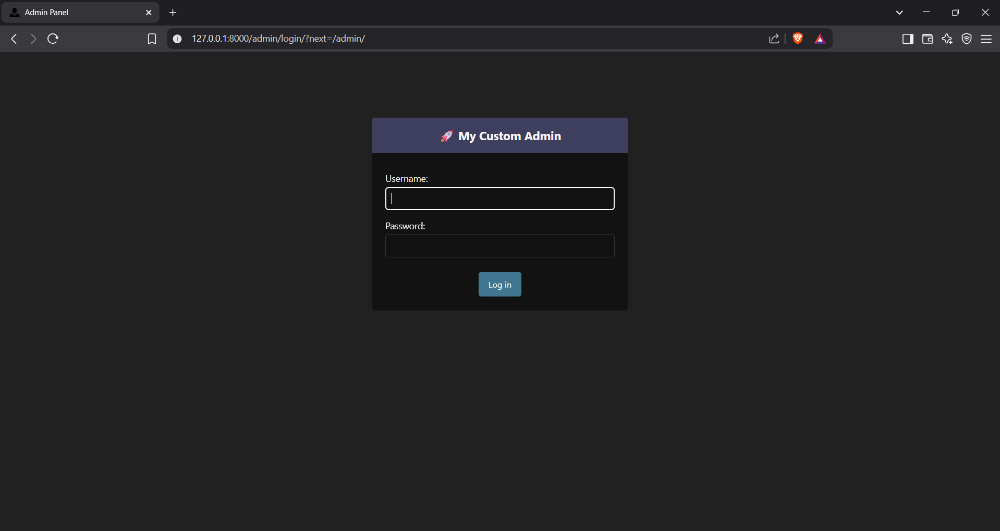
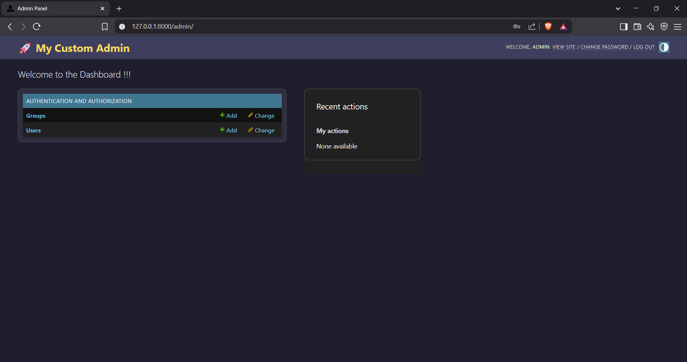

# superuser_theme_django

# 🛠️ Django Admin Customization

This project customizes the default Django admin panel by changing the title, header, icon, and adding custom styles using internal CSS.

---

## ✅ Task Details

1. Changed the admin site title, header, and index title using `admin.py`.
2. Customized the admin layout using `base_site.html`.
3. Added a custom favicon and internal CSS.
4. Attached screenshots of login and admin dashboard.

---

## 🖼️ Screenshots

### 🔐 Login Page

### 📊 Admin Dashboard

---

## ⚙️ Customizations Used

- `admin.site.site_header`
- `admin.site.site_title`
- `admin.site.index_title`
- Overridden `base_site.html`
- Internal CSS via `static/admin/css/custom.css`
- Custom favicon in `static/admin/images/manager.png`
